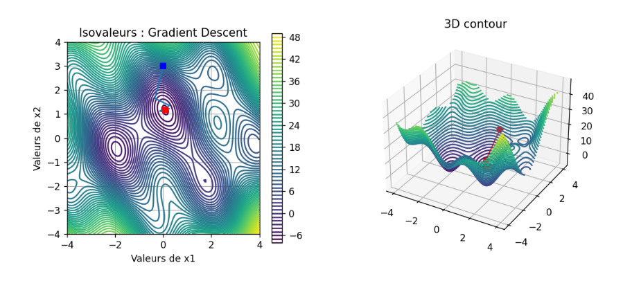

# Optimisation

* Mettre en oeuvre la recherche de minimum par la méthode du gradient à « pas fixe »
* Mettre en oeuvre la recherche de minimum par la méthode de Newton
* Analyser le comportement et les conditions de convergence de ces méthodes

